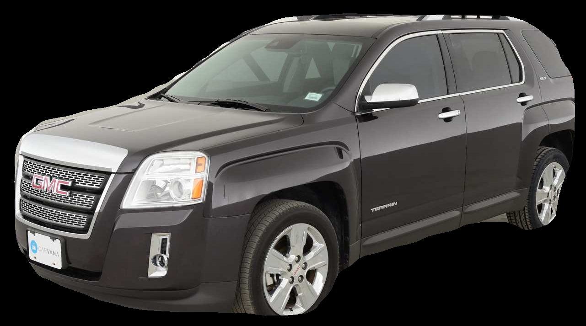

# Carvana Image Masking Challenge Steps

1. Run a detector(Resnet architecture) to extract objects area of interest.
2. Run Mask RCNN to segment the object from its background.
3. Perform Kmeans clustering and Eucledian distance similarity measurement to predic the color of car.

## Result

### Sample files taken from dataset

- [test](https://www.kaggle.com/c/carvana-image-masking-challenge/download/test.zip)

## Execution

To run the code, simply run detect.py

